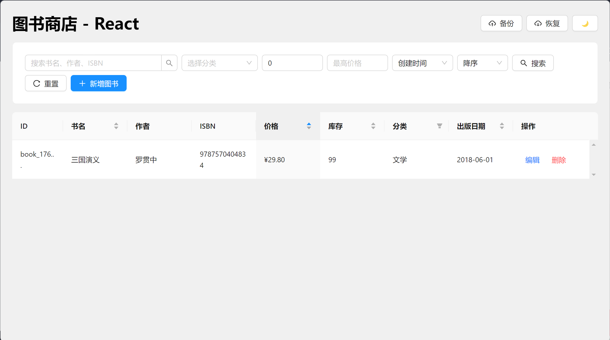

# Electron Hello - 图书管理系统

一个基于 Electron 的跨平台桌面图书管理应用，用于学习 Electron 开发技术栈。


## 📋 目录

- [项目简介](#项目简介)
- [功能特性](#功能特性)
- [技术栈](#技术栈)
- [构建环境](#构建环境)
- [项目架构](#项目架构)
- [项目目录](#项目目录)
- [快速开始](#快速开始)
- [开发指南](#开发指南)
- [构建打包](#构建打包)
- [技术详解](#技术详解)

---

## 📖 项目简介

Electron Hello 是一个基于 Electron 框架开发的桌面图书管理系统，采用与 RunStudio 项目相同的技术栈和架构设计。本项目旨在帮助开发者学习 Electron 应用开发，理解主进程、渲染进程、IPC 通信等核心概念。

### 核心功能

- 📚 **图书管理**：完整的增删改查功能
- 🔍 **搜索筛选**：支持书名、作者、ISBN 搜索，分类、价格筛选
- 📊 **数据展示**：表格展示，支持排序
- 💾 **数据持久化**：IndexedDB + localStorage + 文件系统
- 🎨 **主题切换**：支持明暗主题
- 💼 **数据备份**：支持数据备份和恢复

---

## ✨ 功能特性

### 图书管理

- ✅ 新增图书
- ✅ 编辑图书
- ✅ 删除图书
- ✅ 查看图书列表

### 搜索与筛选

- ✅ 按书名、作者、ISBN 搜索
- ✅ 按分类筛选
- ✅ 按价格范围筛选
- ✅ 按创建时间、价格、书名排序

### 数据存储

- ✅ IndexedDB（Dexie）- 图书数据
- ✅ localStorage（Redux Persist）- 应用状态
- ✅ 文件系统 - 文件存储
- ✅ electron-store - 配置存储

### 其他功能

- ✅ 明暗主题切换
- ✅ 数据备份和恢复
- ✅ 响应式布局

---

## 🛠 技术栈

### 前端技术栈

#### 核心框架

- **React 18.2.0**：现代化的 UI 框架
- **TypeScript 5.6.2**：类型安全的 JavaScript 超集
- **React Router 6**：客户端路由管理

#### UI 组件库

- **Ant Design 5.22.5**：企业级 UI 组件库
- **Styled Components 6.1.11**：CSS-in-JS 样式解决方案

#### 状态管理

- **Redux Toolkit 2.2.5**：现代化的 Redux 状态管理
- **Redux Persist 6.0.0**：Redux 状态持久化
- **React Redux 9.1.2**：React 与 Redux 的绑定

#### 数据存储

- **Dexie 4.0.8**：IndexedDB 的封装库
- **electron-store 8.2.0**：配置存储

### 桌面应用技术栈

#### Electron 核心

- **Electron 31.7.6**：跨平台桌面应用框架
- **electron-vite 2.3.0**：基于 Vite 的 Electron 构建工具
- **electron-builder 24.13.2**：Electron 应用打包工具

#### Electron 工具库

- **@electron-toolkit/utils 3.0.0**：Electron 工具函数
- **@electron-toolkit/preload 3.0.0**：Preload 脚本工具
- **electron-log 5.1.5**：日志记录
- **electron-window-state 5.0.3**：窗口状态管理

### 构建工具

- **Vite 5.0.12**：下一代前端构建工具
- **TypeScript**：类型检查和编译
- **ESLint**：代码检查
- **Prettier**：代码格式化

### 包管理

- **Yarn 4.6.0**：包管理器（使用 Yarn Berry）

---

## 🔧 构建环境

### 系统要求

- **Node.js**：>= 18.0.0
- **Yarn**：>= 4.6.0
- **操作系统**：Windows 10+ / macOS 10.15+ / Linux

### 环境搭建

#### 1. 安装 Node.js

访问 [Node.js 官网](https://nodejs.org/) 下载并安装 Node.js（推荐 LTS 版本）。

验证安装：

```bash
node --version
npm --version
```

#### 2. 安装 Yarn

项目使用 Yarn Berry 4.6.0，需要 Yarn 二进制文件。


```bash
# 使用 npm 安装 Yarn
npm install -g yarn

# 验证安装
yarn --version
```

#### 3. 克隆项目

```bash
git clone <repository-url>
cd electron-hello
```

#### 4. 安装依赖

```bash
yarn install
```

#### 5. 开发环境运行

```bash
yarn dev
```

---

## 🏗 项目架构

### Electron 三层架构

本项目采用经典的 Electron 三层架构：

```
┌─────────────────────────────────────────┐
│         Renderer Process                │
│  (React + Redux + Ant Design)          │
│  - UI 渲染                               │
│  - 用户交互                               │
│  - 状态管理                               │
└──────────────────┬──────────────────────┘
                   │ IPC
┌──────────────────▼──────────────────────┐
│         Preload Script                   │
│  (Context Bridge + API Expose)          │
│  - 安全 API 暴露                          │
└──────────────────┬──────────────────────┘
                   │ Electron IPC
┌──────────────────▼──────────────────────┐
│         Main Process                     │
│  (Node.js + Electron APIs)               │
│  - 窗口管理                               │
│  - 文件系统操作                           │
│  - 系统集成                               │
└─────────────────────────────────────────┘
```

### 数据流架构

```
用户操作
    ↓
React 组件
    ↓
Redux Action
    ↓
Redux Store
    ↓
IndexedDB (持久化)
    ↓
应用重启后恢复
```

### 存储架构

```
┌─────────────────────────────────────────┐
│         数据分类存储策略                  │
├─────────────────────────────────────────┤
│ 图书数据     → IndexedDB (大容量)       │
│ 应用状态     → localStorage (快速)      │
│ 文件数据     → 文件系统 (原始文件)       │
│ 系统配置     → electron-store (结构化)   │
└─────────────────────────────────────────┘
```

### src 目录下的三个核心模块（Java 开发者视角）

如果你是 Java 开发者，理解 Electron 的三个模块会更容易。让我用 Java 的类比来解释：

#### 1. `src/main/` - 主进程（Main Process）

**Java 类比：`public static void main(String[] args)` + 系统服务层**

**作用**：
- 这是整个应用的**入口点**，类似 Java 的 `main` 方法
- 负责**系统级操作**，类似 Java 的 Service 层，可以访问操作系统资源
- **只有一个主进程**，类似 Java 应用只有一个主线程启动

**Java 类比示例**：

```java
// Java 的 main 方法
public class Application {
    public static void main(String[] args) {
        // 启动应用
        ApplicationContext context = new ApplicationContext();
        WindowManager windowManager = new WindowManager();
        windowManager.createMainWindow();
    }
}
```

```typescript
// Electron 的 main/index.ts（类似上面的 Java 代码）
app.whenReady().then(() => {
  // 启动应用
  const mainWindow = windowService.createMainWindow()
  registerIpc(mainWindow, app)
})
```

**主要职责**：

1. **窗口管理**（`services/WindowService.ts`）
   - 创建、关闭、最小化窗口
   - 类似 Java Swing 的 `JFrame` 管理

2. **IPC 通信处理**（`ipc.ts`）
   - 处理来自渲染进程的请求
   - 类似 Java 的 Controller 层，接收前端请求并处理

3. **系统资源访问**
   - 文件系统操作（读取、写入文件）
   - 系统配置（主题、语言等）
   - 类似 Java 可以访问 `File`、`Properties` 等系统资源

4. **应用生命周期管理**
   - 应用启动、退出
   - 单实例控制（防止重复启动）
   - 类似 Java 的 `ApplicationListener`

**关键特点**：
- ✅ 可以访问 **Node.js API**（文件系统、网络等）
- ✅ 可以访问 **Electron API**（窗口、菜单等）
- ✅ 可以访问 **操作系统 API**（系统托盘、通知等）
- ❌ **不能直接操作 DOM**（不能写 HTML/CSS）
- ❌ **不能使用浏览器 API**（如 `localStorage`、`fetch` 等）

**目录结构**：

```
src/main/
├── index.ts              # 应用入口（类似 Java 的 main 方法）
├── ipc.ts                # IPC 处理器（类似 Java 的 Controller）
├── constant.ts           # 常量定义
├── services/             # 业务服务层（类似 Java 的 Service 层）
│   ├── WindowService.ts  # 窗口管理服务
│   ├── ConfigManager.ts # 配置管理服务
│   └── BackupManager.ts # 备份管理服务
└── utils/                # 工具函数（类似 Java 的 Util 类）
    └── file.ts           # 文件操作工具
```

---

#### 2. `src/preload/` - 预加载脚本（Preload Script）

**Java 类比：接口（Interface）或代理层（Proxy）**

**作用**：
- 在主进程和渲染进程之间建立**安全桥梁**
- 类似 Java 的接口定义，规定了渲染进程可以调用哪些方法
- 类似 Java 的代理模式，隐藏了底层实现细节

**Java 类比示例**：

```java
// Java 接口定义
public interface SystemAPI {
    String getAppInfo();
    void setTheme(String theme);
    void createBackup(String fileName, String data);
}

// Java 实现类（在主进程中）
public class SystemAPIImpl implements SystemAPI {
    public String getAppInfo() {
        return app.getVersion();
    }
    // ...
}
```

```typescript
// Electron 的 preload/index.ts（类似上面的接口定义）
const api = {
  getAppInfo: () => ipcRenderer.invoke('app:info'),
  setTheme: (theme: 'light' | 'dark') => ipcRenderer.invoke('app:set-theme', theme),
  backup: {
    create: (fileName: string, data: string) => 
      ipcRenderer.invoke('backup:create', fileName, data)
  }
}

// 暴露给渲染进程使用（类似 Java 的接口暴露）
contextBridge.exposeInMainWorld('api', api)
```

**主要职责**：

1. **API 暴露**
   - 将主进程的功能安全地暴露给渲染进程
   - 类似 Java 定义接口，让前端知道可以调用哪些方法

2. **安全隔离**
   - 使用 `contextBridge` 安全地传递数据
   - 防止渲染进程直接访问 Node.js API（安全考虑）
   - 类似 Java 的访问控制，只暴露必要的接口

3. **类型定义**（`index.d.ts`）
   - 提供 TypeScript 类型定义
   - 类似 Java 的接口文档，告诉开发者有哪些方法可用

**工作流程**：

```
渲染进程调用: window.api.getAppInfo()
    ↓
Preload 脚本: ipcRenderer.invoke('app:info')
    ↓
主进程处理: ipcMain.handle('app:info', () => {...})
    ↓
返回结果: 通过 IPC 返回给渲染进程
```

**关键特点**：
- ✅ 在**渲染进程加载前**运行
- ✅ 可以访问 **Node.js API** 和 **Electron API**
- ✅ 通过 `contextBridge` 安全暴露 API
- ❌ **不能操作 DOM**（不能写 HTML）
- ❌ **不能直接访问渲染进程的变量**

**为什么需要 Preload？**

**安全问题**：如果不使用 Preload，渲染进程（网页）可以直接访问 Node.js API，这很危险！

```typescript
// ❌ 危险：渲染进程直接访问 Node.js（不安全）
// 如果网页被恶意代码注入，可以删除你的文件！
window.require('fs').unlinkSync('重要文件.txt')

// ✅ 安全：通过 Preload 暴露安全的 API
window.api.backup.create('backup.json', data) // 只能调用我们定义的方法
```

---

#### 3. `src/renderer/` - 渲染进程（Renderer Process）

**Java 类比：Swing GUI 应用的前端界面层**

**作用**：
- 负责**显示用户界面**，类似 Java Swing 的 `JPanel`、`JButton` 等组件
- 运行在**浏览器环境**中，可以使用所有 Web 技术（HTML、CSS、JavaScript）
- 类似 Java 的 View 层，负责展示和用户交互

**Java 类比示例**：

```java
// Java Swing 应用
public class BookStoreFrame extends JFrame {
    private JTable bookTable;
    private JButton addButton;
    
    public BookStoreFrame() {
        // 创建界面组件
        bookTable = new JTable();
        addButton = new JButton("添加图书");
        
        // 布局
        add(bookTable, BorderLayout.CENTER);
        add(addButton, BorderLayout.SOUTH);
        
        // 事件处理
        addButton.addActionListener(e -> {
            // 调用后端服务
            bookService.addBook(newBook);
        });
    }
}
```

```typescript
// Electron 的 renderer（类似上面的 Java Swing 代码）
function BookStorePage() {
  const [books, setBooks] = useState([])
  
  return (
    <div>
      <Table dataSource={books} />
      <Button onClick={handleAdd}>添加图书</Button>
    </div>
  )
  
  const handleAdd = async () => {
    // 通过 Preload 暴露的 API 调用主进程
    await window.api.backup.create('backup.json', data)
  }
}
```

**主要职责**：

1. **UI 渲染**
   - 使用 React 组件构建界面
   - 类似 Java Swing 的组件布局

2. **用户交互**
   - 处理用户点击、输入等操作
   - 类似 Java 的事件监听器（`ActionListener`）

3. **状态管理**
   - 使用 Redux 管理应用状态
   - 类似 Java 的 Model 层，存储业务数据

4. **数据展示**
   - 从 IndexedDB 读取数据并展示
   - 类似 Java 从数据库读取数据并显示在表格中

**目录结构**：

```
src/renderer/
├── index.html            # HTML 入口（类似 Java 的窗口定义）
└── src/
    ├── main.tsx          # React 入口（类似 Java 的 main 方法启动 GUI）
    ├── App.tsx            # 根组件（类似 Java 的主窗口类）
    ├── pages/             # 页面组件（类似 Java 的各个窗口类）
    │   ├── BookStorePage.tsx
    │   └── components/    # 子组件（类似 Java 的自定义组件）
    ├── store/             # Redux 状态管理（类似 Java 的 Model 层）
    ├── context/           # React Context（类似 Java 的全局配置）
    ├── databases/         # 数据库定义（类似 Java 的 DAO 层）
    └── types/             # 类型定义（类似 Java 的实体类）
```

**关键特点**：
- ✅ 可以使用 **所有 Web API**（`localStorage`、`fetch`、`IndexedDB` 等）
- ✅ 可以使用 **React、Vue 等前端框架**
- ✅ 可以使用 **HTML、CSS、JavaScript**
- ✅ 可以操作 **DOM**
- ❌ **不能直接访问 Node.js API**（需要通过 Preload）
- ❌ **不能直接访问文件系统**（需要通过 IPC 调用主进程）

---

### 三个模块的协作关系

**完整的数据流**（以"创建备份"为例）：

```
1. 用户在渲染进程点击"备份"按钮
   ↓
2. React 组件调用: window.api.backup.create(...)
   ↓
3. Preload 脚本接收: ipcRenderer.invoke('backup:create', ...)
   ↓
4. 主进程处理: ipcMain.handle('backup:create', ...)
   ↓
5. 主进程调用 BackupManager 服务（类似 Java 的 Service 层）
   ↓
6. 主进程操作文件系统，创建备份文件
   ↓
7. 结果通过 IPC 返回给渲染进程
   ↓
8. React 组件显示"备份成功"提示
```

**Java 对比**：

```java
// Java 三层架构
Controller (渲染进程) 
    → Service (主进程)
        → DAO (文件系统操作)

// Electron 三层架构
Renderer (渲染进程)
    → Preload (接口层)
        → Main (主进程)
            → Services (业务逻辑)
                → File System (系统资源)
```

---

### 总结对比表

| 模块 | Java 类比 | 运行环境 | 可以做什么 | 不能做什么 |
|------|----------|----------|------------|------------|
| **main** | `main` 方法 + Service 层 | Node.js 环境 | 访问系统资源、文件操作、窗口管理 | 操作 DOM、使用浏览器 API |
| **preload** | 接口/代理层 | Node.js 环境 | 暴露 API、安全桥接 | 操作 DOM、直接访问渲染进程变量 |
| **renderer** | Swing GUI 界面层 | 浏览器环境 | HTML/CSS/JS、React、Web API | 直接访问 Node.js API、文件系统 |

**记忆口诀**：
- **main** = 后台服务（Java 的 Service 层）
- **preload** = 接口定义（Java 的 Interface）
- **renderer** = 前端界面（Java 的 Swing GUI）

---

## 📁 项目目录

```
electron-hello/
├── build/                      # 构建资源
│   ├── icon.ico               # Windows 图标
│   └── icon.png               # Linux/macOS 图标
│
├── src/                        # 源代码目录
│   ├── main/                  # 主进程代码
│   │   ├── index.ts          # 主进程入口
│   │   ├── ipc.ts            # IPC 处理器注册
│   │   ├── constant.ts       # 常量定义
│   │   ├── services/         # 业务服务
│   │   │   ├── WindowService.ts      # 窗口管理
│   │   │   ├── ConfigManager.ts      # 配置管理
│   │   │   └── BackupManager.ts      # 备份管理
│   │   └── utils/            # 工具函数
│   │       └── file.ts        # 文件工具
│   │
│   ├── preload/              # 预加载脚本
│   │   ├── index.ts         # Preload 入口
│   │   └── index.d.ts       # 类型定义
│   │
│   └── renderer/             # 渲染进程代码
│       ├── index.html       # HTML 入口
│       └── src/
│           ├── main.tsx     # React 入口
│           ├── App.tsx      # 根组件
│           ├── pages/       # 页面组件
│           │   ├── BookStorePage.tsx
│           │   └── components/
│           │       ├── BookModal.tsx
│           │       └── BackupModal.tsx
│           ├── store/        # Redux Store
│           │   ├── index.ts
│           │   ├── books.ts
│           │   └── settings.ts
│           ├── databases/    # 数据库定义
│           │   └── index.ts
│           ├── context/      # React Context
│           │   ├── ThemeProvider.tsx
│           │   └── AntdProvider.tsx
│           └── types/         # 类型定义
│               └── index.ts
│
├── .gitignore                # Git 忽略文件
├── eslint.config.mjs         # ESLint 代码检查配置（ESLint 9 flat config）
├── .prettierrc.yaml         # Prettier 代码格式化配置
├── .yarnrc.yml              # Yarn 配置文件（Yarn Berry）
├── .yarn/                   # Yarn 相关文件
│   └── releases/            # Yarn 二进制文件
│       └── yarn-4.6.0.cjs   # Yarn 4.6.0 可执行文件
├── yarn.lock                # Yarn 依赖锁定文件（自动生成）
├── electron-builder.yml     # Electron Builder 配置
├── electron.vite.config.ts  # Electron Vite 配置
├── package.json             # 项目配置
├── tsconfig.json            # TypeScript 配置
├── tsconfig.node.json       # Node 环境 TS 配置
├── tsconfig.web.json        # Web 环境 TS 配置
├── LICENSE                  # 许可证
└── README.md                # 项目说明
```

### 目录说明

#### `src/main/` - 主进程

- **index.ts**：应用入口，初始化窗口和服务
- **ipc.ts**：IPC 处理器注册
- **services/**：业务服务
  - `WindowService.ts`：窗口生命周期管理
  - `ConfigManager.ts`：配置管理（主题、语言等）
  - `BackupManager.ts`：数据备份和恢复
- **utils/**：工具函数

#### `src/preload/` - 预加载脚本

- **index.ts**：通过 `contextBridge` 安全暴露 API
- **index.d.ts**：TypeScript 类型定义

#### `src/renderer/` - 渲染进程

- **pages/**：页面组件
  - `BookStorePage.tsx`：图书管理主页面
  - `components/`：页面子组件
- **store/**：Redux 状态管理
  - `index.ts`：Store 配置
  - `books.ts`：图书状态
  - `settings.ts`：设置状态
- **databases/**：数据库定义（Dexie）
- **context/**：React Context
  - `ThemeProvider.tsx`：主题管理
  - `AntdProvider.tsx`：Ant Design 配置

### 配置文件说明

运行 `yarn install` 后，项目根目录会自动生成或更新以下配置文件：

#### `yarn.lock` - Yarn 锁定文件

**作用**：

- 锁定所有依赖包的精确版本号，确保团队成员和 CI/CD 环境安装相同版本的依赖
- 记录依赖包的依赖关系树，保证依赖解析的一致性
- 包含每个包的校验和（checksum），确保包完整性

**特点**：

- 由 Yarn 自动生成，**不要手动编辑**
- 应该提交到 Git 仓库，确保团队使用相同的依赖版本
- 文件较大（通常几千行），包含所有依赖的详细信息

**示例内容**：

```yaml
# This file is generated by running "yarn install" inside your project.
# Manual changes might be lost - proceed with caution!

__metadata:
  version: 8
  cacheKey: 10c0

'react@npm:^18.2.0':
  version: 18.2.0
  resolution: 'react@npm:18.2.0'
  checksum: 10c0/...
  dependencies:
    loose-envify: 'npm:^1.1.0'
```

**何时更新**：

- 运行 `yarn install` 时会自动更新
- 添加、更新或删除依赖时会更新
- 运行 `yarn upgrade` 时会更新

#### `.yarnrc.yml` - Yarn 配置文件

**作用**：

- 配置 Yarn 的行为和设置
- 指定 Yarn 版本和路径
- 配置包链接方式、缓存位置等

**当前配置**：

```yaml
nodeLinker: node-modules # 使用传统的 node_modules 目录结构
yarnPath: .yarn/releases/yarn-4.6.0.cjs # 指定 Yarn 二进制文件路径
```

**配置说明**：

- `nodeLinker: node-modules`：使用传统的 `node_modules` 目录（而不是 Yarn PnP）
- `yarnPath`：指定项目使用的 Yarn 版本，确保团队使用相同的 Yarn 版本

**其他常用配置**：

```yaml
# 设置缓存目录
cacheFolder: '.yarn/cache'

# 设置超时时间
httpTimeout: 300000

# 启用不可变安装（CI/CD 环境推荐）
enableImmutableInstalls: true

# 配置镜像源（如果需要）
npmRegistryServer: 'https://registry.npmmirror.com'
```

**注意事项**：

- 应该提交到 Git 仓库
- 修改后需要重新运行 `yarn install`

#### `.prettierrc.yaml` - Prettier 代码格式化配置

**作用**：

- 配置 Prettier 代码格式化工具的规则
- 统一团队代码风格，自动格式化代码

**当前配置**：

```yaml
semi: false # 不使用分号
singleQuote: true # 使用单引号
printWidth: 100 # 每行最大长度 100 字符
trailingComma: 'none' # 不使用尾随逗号
arrowParens: 'avoid' # 箭头函数参数避免括号
```

**配置说明**：

- `semi: false`：JavaScript/TypeScript 代码不使用分号结尾
- `singleQuote: true`：字符串使用单引号而不是双引号
- `printWidth: 100`：代码行宽限制为 100 个字符
- `trailingComma: 'none'`：对象和数组最后一个元素后不加逗号
- `arrowParens: 'avoid'`：单参数箭头函数省略括号，如 `x => x` 而不是 `(x) => x`

**使用方式**：

```bash
# 格式化所有文件
yarn format

# 或在编辑器中配置自动格式化
# VS Code: 安装 Prettier 扩展，保存时自动格式化
```

**其他常用配置选项**：

```yaml
tabWidth: 2 # 缩进使用 2 个空格
useTabs: false # 不使用 Tab，使用空格
bracketSpacing: true # 对象括号内加空格 { foo: bar }
jsxSingleQuote: false # JSX 中使用双引号
endOfLine: 'lf' # 使用 LF 换行符（Unix 风格）
```

**注意事项**：

- 应该提交到 Git 仓库，确保团队使用相同的格式化规则
- 与 ESLint 配合使用时，需要安装 `eslint-config-prettier` 避免冲突

#### `eslint.config.mjs` - ESLint 代码检查配置

**作用**：

- 配置 ESLint 代码检查工具的规则
- 定义代码规范和检查规则，确保代码质量
- 使用 ESLint 9 的 flat config 格式（新的配置格式）

**当前配置**：

```javascript
import electronConfigPrettier from '@electron-toolkit/eslint-config-prettier'
import tseslint from '@electron-toolkit/eslint-config-ts'
import eslint from '@eslint/js'

export default [
  eslint.configs.recommended,
  ...tseslint.configs.recommended,
  electronConfigPrettier,
  {
    rules: {
      '@typescript-eslint/no-explicit-any': 'off',
      '@typescript-eslint/no-unused-vars': ['warn', { argsIgnorePattern: '^_' }]
    }
  },
  {
    ignores: ['node_modules/**', 'dist/**', 'out/**', '.yarn/**']
  }
]
```

**配置说明**：

- **`eslint.configs.recommended`**：ESLint 官方推荐规则集
- **`tseslint.configs.recommended`**：TypeScript ESLint 推荐规则集（来自 `@electron-toolkit/eslint-config-ts`）
- **`electronConfigPrettier`**：Prettier 集成配置，避免与 ESLint 规则冲突
- **自定义规则**：
  - `@typescript-eslint/no-explicit-any: 'off'`：关闭禁止使用 `any` 类型的检查
  - `@typescript-eslint/no-unused-vars: ['warn', { argsIgnorePattern: '^_' }]`：未使用的变量显示警告，但以下划线开头的参数会被忽略
- **`ignores`**：忽略检查的目录和文件模式

**为什么使用 flat config？**

- ESLint 9 默认使用新的 flat config 格式（`eslint.config.mjs`）
- 旧的 `.eslintrc.*` 格式在 ESLint 9 中已不再支持
- Flat config 提供更灵活的配置方式，支持 ES 模块导入

**使用方式**：

```bash
# 检查代码
yarn lint

# 自动修复可修复的问题
yarn lint --fix
```

**在编辑器中使用**：

- **VS Code**：安装 ESLint 扩展，会自动读取 `eslint.config.mjs` 配置
- 保存文件时自动检查代码
- 错误和警告会显示在编辑器中

**注意事项**：

- 应该提交到 Git 仓库，确保团队使用相同的代码规范
- 与 Prettier 配合使用时，需要 `@electron-toolkit/eslint-config-prettier` 避免规则冲突
- 如果遇到 "Invalid Options" 错误，检查 ESLint 版本是否为 9.x，并确保使用 flat config 格式

**从旧配置迁移**：

如果项目之前使用 `.eslintrc.cjs`，需要迁移到 `eslint.config.mjs`：

1. 删除 `.eslintrc.cjs` 文件
2. 创建 `eslint.config.mjs` 文件（使用上面的配置格式）
3. 更新 `package.json` 中的 lint 脚本（移除 `--ext` 参数）

#### 其他配置文件

**`.gitignore`**：

- Git 忽略文件配置
- 通常忽略 `node_modules/`、`.yarn/cache/`、`dist/` 等

**`tsconfig.json`**：

- TypeScript 编译配置
- 定义类型检查规则和编译选项

---

## 🚀 快速开始

### 1. 安装依赖

```bash
yarn install
```

### 2. 开发模式运行

```bash
yarn dev
```

这将启动 Electron 应用，并开启热重载。

### 3. 构建应用

```bash
yarn build
```

### 4. 类型检查

```bash
yarn typecheck
```

---

## 💻 开发指南

### 开发流程

1. **启动开发服务器**

   ```bash
   yarn dev
   ```

2. **修改代码**
   - 修改主进程代码：`src/main/`
   - 修改渲染进程代码：`src/renderer/src/`
   - 修改预加载脚本：`src/preload/`

3. **热重载**
   - 渲染进程支持热重载（HMR）
   - 主进程修改后需要重启应用

### 代码规范

#### TypeScript

- 使用严格模式
- 避免使用 `any`，使用具体类型
- 接口优先于类型别名

#### React 组件

- 使用函数组件和 Hooks
- 组件文件使用 PascalCase
- Props 使用 TypeScript 接口定义

#### 文件组织

- 按功能模块组织文件
- 每个模块包含：组件、服务、类型、工具函数
- 使用路径别名（`@renderer`、`@main`）

### 添加新功能

#### 1. 添加新的 IPC 通信

**主进程** (`src/main/ipc.ts`)：

```typescript
ipcMain.handle('new:action', async (_, data) => {
  // 处理逻辑
  return result
})
```

**预加载脚本** (`src/preload/index.ts`)：

```typescript
newAction: (data: any) => ipcRenderer.invoke('new:action', data)
```

**渲染进程**：

```typescript
const result = await window.api.newAction(data)
```

#### 2. 添加新的 Redux State

**创建 Slice** (`src/renderer/src/store/newFeature.ts`)：

```typescript
import { createSlice } from '@reduxjs/toolkit'

const newFeatureSlice = createSlice({
  name: 'newFeature',
  initialState: {},
  reducers: {}
})

export default newFeatureSlice.reducer
```

**注册到 Store** (`src/renderer/src/store/index.ts`)：

```typescript
import newFeature from './newFeature'

const rootReducer = combineReducers({
  // ...
  newFeature
})
```

#### 3. 添加新的数据库表

**定义表** (`src/renderer/src/databases/index.ts`)：

```typescript
export const db = new Dexie('ElectronHello') as Dexie & {
  // ...
  newTable: EntityTable<NewType, 'id'>
}

db.version(2).stores({
  // ...
  newTable: '&id, field1, field2'
})
```

---

## 📦 构建打包

### 开发构建

```bash
yarn build
```

### 打包应用

#### Windows

```bash
# 需要先构建
yarn build

# 然后打包（需要 electron-builder）
npx electron-builder --win
```

#### macOS

```bash
npx electron-builder --mac
```

#### Linux

```bash
npx electron-builder --linux
```

### 打包配置

打包配置在 `electron-builder.yml` 中：

- **Windows**：NSIS 安装程序
- **macOS**：dmg 和 zip
- **Linux**：AppImage、deb、rpm

#### electron-builder.yml 配置文件详解

`electron-builder.yml` 是 **electron-builder** 工具的配置文件（不是 electron-vite 的）。electron-builder 负责将构建好的应用打包成安装包，而 electron-vite 负责开发和构建代码。

**工具分工：**
- **electron-vite**：开发与构建工具，编译 TypeScript、打包代码
- **electron-builder**：打包工具，将构建产物打包成安装包（Windows、macOS、Linux）

**工作流程：**
```
开发阶段 → electron-vite dev (开发)
    ↓
构建阶段 → electron-vite build (编译代码到 out 目录)
    ↓
打包阶段 → electron-builder (读取 electron-builder.yml，打包成安装包)
```

**配置文件逐行说明：**

##### 基础应用信息（1-3行）

**第1行** `appId: com.electron.hello`
- 应用唯一标识符（反向域名格式），用于系统注册和更新

**第2行** `productName: Electron Hello`
- 产品名称，用于安装包和快捷方式

**第3行** `copyright: Copyright @ 2025`
- 版权信息

##### 目录配置（4-6行）

**第4行** `directories:`
- 目录配置块开始

**第5行** `buildResources: build`
- 构建资源目录（图标、脚本等）

**第6行** `output: dist`
- 输出目录（打包产物）

##### ASAR 配置（7行）

**第7行** `asar: true`
- 启用 ASAR 打包（将应用打包为单个归档文件）

##### 文件包含/排除配置（8-27行）

**第8行** `files:`
- 文件包含/排除配置块开始

**第9行** `- '!src/**'`
- 排除 src 目录及其所有子目录

**第10行** `- '!src'`
- 排除 src 目录本身

**第11-12行** 排除 scripts 目录
- 排除脚本目录及其子目录

**第13行** `- '!docs/**'`
- 排除 docs 目录

**第14行** `- '!**/*.ts'`
- 排除所有 TypeScript 源码文件

**第15行** `- '!**/*.tsx'`
- 排除所有 TSX 源码文件

**第16行** `- '!**/*.less'`
- 排除所有 Less 样式源码文件

**第17行** `- '!**/*.scss'`
- 排除所有 SCSS 样式源码文件

**第18行** `- '!**/*.sass'`
- 排除所有 SASS 样式源码文件

**第19行** `- '!**/*.css.d.ts'`
- 排除 CSS 类型定义文件

**第20行** `- '!**/*.d.ts'`
- 排除所有 TypeScript 类型定义文件

**第21行** `- '!**/{test,tests,__tests__,coverage}/**'`
- 排除测试目录和覆盖率目录

**第22行** `- '!**/*.{spec,test}.{js,jsx,ts,tsx}'`
- 排除所有测试文件（spec、test 后缀）

**第23行** `- '!**/*.map'`
- 排除所有 Source Map 文件

**第24行** `- '!**/{LICENSE,LICENSE.txt,README.md,CHANGELOG.md}'`
- 排除许可证和文档文件

**第25行** `- '!**/*.md'`
- 排除所有 Markdown 文件

**第26行** `- '!**/{.DS_Store,Thumbs.db}'`
- 排除系统文件（macOS 和 Windows）

**第27行** `- '!**/.git/**'`
- 排除 Git 版本控制目录

##### Windows 平台配置（28-33行）

**第28行** `win:`
- Windows 平台配置块开始

**第29行** `executableName: ElectronHello`
- Windows 可执行文件名

**第30行** `artifactName: ${productName}-${version}-setup.${ext}`
- 安装包文件名模板（使用变量：产品名-版本号-setup.扩展名）

**第31-32行** `target:` / `- target: nsis`
- 打包目标：NSIS 安装程序

**第33行** `icon: build/icon.ico`
- Windows 应用图标路径

##### macOS 平台配置（34-44行）

**第34行** `mac:`
- macOS 平台配置块开始

**第35行** `artifactName: ${productName}-${version}-${arch}.${ext}`
- 安装包文件名模板（包含架构信息）

**第36-44行** `target:`
- 打包目标配置
  - **第37-40行**：DMG 格式，支持 arm64 和 x64 架构
  - **第41-44行**：ZIP 格式，支持 arm64 和 x64 架构

##### Linux 平台配置（45-57行）

**第45行** `linux:`
- Linux 平台配置块开始

**第46行** `artifactName: ${productName}-${version}-${arch}.${ext}`
- 安装包文件名模板（包含架构信息）

**第47-55行** `target:`
- 打包目标配置
  - **第48-51行**：AppImage 格式，支持 arm64 和 x64 架构
  - **第52-55行**：deb 格式，支持 arm64 和 x64 架构

**第56行** `icon: build/icon.png`
- Linux 应用图标路径

**总结：** 该配置文件用于将 Electron Hello 应用打包为 Windows（NSIS）、macOS（DMG/ZIP）和 Linux（AppImage/deb）安装包，并排除了源码、测试、文档等开发文件，仅打包编译后的生产文件。

---

## 📚 技术详解

### Electron 核心概念

#### 1. 主进程（Main Process）

主进程是 Electron 应用的入口点，负责：

- 创建和管理应用窗口
- 处理系统级操作
- 管理应用生命周期

**关键文件**：

- `src/main/index.ts`：应用入口
- `src/main/services/WindowService.ts`：窗口管理

#### 2. 渲染进程（Renderer Process）

渲染进程负责显示用户界面：

- 运行在 Chromium 环境中
- 可以使用所有 Web API
- 通过 IPC 与主进程通信

**关键文件**：

- `src/renderer/src/main.tsx`：React 入口
- `src/renderer/src/App.tsx`：根组件

#### 3. 预加载脚本（Preload Script）

预加载脚本在主进程和渲染进程之间建立桥梁：

- 在渲染进程加载前运行
- 可以访问 Node.js API
- 通过 `contextBridge` 安全暴露 API

**关键文件**：

- `src/preload/index.ts`：Preload 入口

### IPC 通信

#### 请求-响应模式

```typescript
// 主进程
ipcMain.handle('app:info', () => {
  return { version: app.getVersion() }
})

// 渲染进程
const info = await window.api.getAppInfo()
```

#### 事件监听模式

```typescript
// 主进程
mainWindow.webContents.send('theme-changed', theme)

// 渲染进程
window.api.onThemeChanged(theme => {
  console.log('Theme changed:', theme)
})
```

### 数据存储

#### IndexedDB（Dexie）

##### 什么是 IndexedDB？

IndexedDB 是浏览器提供的客户端 NoSQL 数据库 API，用于在浏览器中存储大量结构化数据。

**主要特点：**

- **大容量存储**：通常可存储数百 MB 到数 GB 的数据
- **异步操作**：基于 Promise/回调，不会阻塞主线程
- **键值对存储**：支持对象存储（Object Store）
- **索引支持**：可以创建索引以加速查询
- **事务支持**：保证数据一致性
- **持久化**：数据保存在本地，关闭浏览器后仍然存在

##### 什么是 Dexie？

Dexie 是 IndexedDB 的封装库，让 IndexedDB 的使用变得简单易用。

**主要优势：**

- **更简洁的 API**：类似 ORM 的语法，代码更易读
- **TypeScript 支持**：提供完整的类型定义
- **原生 Promise 支持**：无需处理回调，直接使用 `await`
- **版本管理**：内置数据库版本升级机制
- **强大的查询能力**：提供链式查询 API
- **React 集成**：`dexie-react-hooks` 提供 React Hooks

##### 为什么选择 Dexie？

相比直接使用原生 IndexedDB API，Dexie 提供了更简洁的代码：

**原生 IndexedDB（回调方式）：**

```javascript
// ❌ 原生 IndexedDB 使用回调，代码嵌套深
const request = indexedDB.open('MyDatabase', 1)

request.onsuccess = function (event) {
  const db = event.target.result
  const transaction = db.transaction(['books'], 'readwrite')
  const store = transaction.objectStore('books')

  const addRequest = store.add({ title: '新书' })

  addRequest.onsuccess = function () {
    console.log('添加成功')
    // 如果要继续查询，又要嵌套一层
    const getRequest = store.get(1)
    getRequest.onsuccess = function () {
      console.log('查询结果:', getRequest.result)
      // 这就是"回调地狱"（Callback Hell）
    }
    getRequest.onerror = function () {
      console.error('查询失败')
    }
  }

  addRequest.onerror = function () {
    console.error('添加失败')
  }
}

request.onerror = function () {
  console.error('打开数据库失败')
}
```

**Dexie（Promise 方式）：**

```typescript
// ✅ Dexie 使用 Promise，代码简洁清晰
import { db } from './databases'

// 添加数据
await db.books.add({ title: '新书' })
console.log('添加成功')

// 查询数据 - 不需要嵌套！
const book = await db.books.get(1)
console.log('查询结果:', book)

// 更新数据 - 继续用 await，代码是线性的！
await db.books.update(1, { title: '更新后的书名' })
```

##### 数据库定义

在 `src/renderer/src/databases/index.ts` 中定义数据库：

```typescript
import { Dexie, type EntityTable } from 'dexie'
import type { Book } from '@renderer/types'

export const db = new Dexie('ElectronHello') as Dexie & {
  books: EntityTable<Book, 'id'>
  settings: EntityTable<{ id: string; value: any }, 'id'>
}

// 定义表结构
db.version(1).stores({
  books: '&id, title, author, isbn, price, stock, category, publishDate, createdAt, updatedAt',
  settings: '&id, value'
})
```

##### 基本操作

**添加数据：**

```typescript
await db.books.add({
  id: 'book_1',
  title: 'JavaScript 高级程序设计',
  author: 'Matt Frisbie',
  isbn: '978-7-115-48789-5',
  price: 129,
  stock: 10,
  category: '科技',
  publishDate: '2020-01-01',
  createdAt: Date.now(),
  updatedAt: Date.now()
})
```

**查询数据：**

```typescript
// 根据 ID 查询
const book = await db.books.get('book_1')

// 查询所有
const allBooks = await db.books.toArray()

// 条件查询
const techBooks = await db.books.where('category').equals('科技').toArray()

// 范围查询
const expensiveBooks = await db.books.where('price').above(100).toArray()
```

**更新数据：**

```typescript
await db.books.update('book_1', {
  price: 99,
  updatedAt: Date.now()
})
```

**删除数据：**

```typescript
await db.books.delete('book_1')
```

##### 错误处理

使用 Promise/await 时，通过 `try-catch` 统一处理错误：

```typescript
// 在项目中的实际使用示例
const saveBookToDB = async (book: Book) => {
  try {
    if (await db.books.get(book.id)) {
      await db.books.update(book.id, book)
    } else {
      await db.books.add(book)
    }
  } catch (error) {
    console.error('Save book to DB failed:', error)
    throw error // 可以向上抛出错误
  }
}

// 完整的错误处理示例
const handleDelete = async (id: string) => {
  try {
    await db.books.delete(id)
    dispatch(deleteBook(id))
    message.success('删除成功')
  } catch (error) {
    message.error('删除失败')
    console.error(error)
  } finally {
    // finally 块无论成功或失败都会执行
    setLoading(false)
  }
}
```

**常见错误类型处理：**

```typescript
const addBook = async (book: Book) => {
  try {
    await db.books.add(book)
    message.success('添加成功')
  } catch (error: any) {
    // Dexie 会抛出具体的错误类型
    switch (error.name) {
      case 'ConstraintError':
        // 主键冲突（ID 已存在）
        message.error('该图书ID已存在，请使用不同的ID')
        break
      case 'QuotaExceededError':
        // 存储空间不足
        message.error('存储空间不足，请清理数据')
        break
      case 'InvalidStateError':
        // 数据库状态错误
        message.error('数据库状态异常，请刷新页面')
        break
      default:
        message.error('添加失败: ' + error.message)
    }
    console.error('详细错误:', error)
  }
}
```

**Promise vs 回调的错误处理对比：**

回调方式需要在每个 `onerror` 中分别处理错误，而 Promise 方式可以在一个 `try-catch` 中统一处理所有错误，代码更简洁、更易维护。

##### 版本升级

当需要修改数据库结构时，使用版本升级：

```typescript
// 版本 1
db.version(1).stores({
  books: '&id, title, author'
})

// 版本 2：添加新字段
db.version(2)
  .stores({
    books: '&id, title, author, price, category' // 添加了 price 和 category
  })
  .upgrade(async tx => {
    // 数据迁移逻辑
    const books = await tx.table('books').toCollection().toArray()
    for (const book of books) {
      await tx.table('books').update(book.id, {
        price: 0, // 为新字段设置默认值
        category: '未分类'
      })
    }
  })
```

##### 在项目中的使用

本项目使用 Dexie 存储以下数据：

- **图书数据**：存储在 `books` 表中
- **应用设置**：存储在 `settings` 表中

实际使用示例请参考：

- `src/renderer/src/pages/BookStorePage.tsx`：图书管理页面的数据库操作
- `src/renderer/src/pages/components/BackupModal.tsx`：备份恢复功能中的数据库操作

#### localStorage（Redux Persist）

##### 什么是 localStorage？

localStorage 是浏览器提供的 Web Storage API 之一，用于在浏览器中存储键值对数据。

**主要特点：**

- **同步操作**：操作是同步的，会阻塞主线程（但通常很快）
- **存储限制**：通常限制为 5-10 MB（不同浏览器不同）
- **持久化**：数据保存在本地，关闭浏览器后仍然存在
- **同源策略**：只能访问同源（相同协议、域名、端口）的数据
- **字符串存储**：只能存储字符串，对象需要序列化（JSON.stringify）
- **简单易用**：API 非常简单，只有 `getItem`、`setItem`、`removeItem` 等方法

**基本使用：**

```javascript
// 存储数据
localStorage.setItem('username', '张三')
localStorage.setItem('theme', 'dark')

// 读取数据
const username = localStorage.getItem('username') // '张三'
const theme = localStorage.getItem('theme') // 'dark'

// 删除数据
localStorage.removeItem('username')

// 清空所有数据
localStorage.clear()

// 存储对象（需要序列化）
const user = { name: '张三', age: 25 }
localStorage.setItem('user', JSON.stringify(user))
const userObj = JSON.parse(localStorage.getItem('user') || '{}')
```

##### 什么是 Redux Persist？

Redux Persist 是一个 Redux 中间件，用于自动将 Redux Store 的状态持久化到存储中（如 localStorage），并在应用重新加载时自动恢复状态。

**主要功能：**

- **自动持久化**：Redux Store 状态变化时自动保存到 localStorage
- **自动恢复**：应用启动时自动从 localStorage 恢复状态
- **选择性持久化**：可以选择哪些状态需要持久化，哪些不需要
- **版本管理**：支持数据版本迁移
- **多种存储引擎**：支持 localStorage、sessionStorage、IndexedDB 等

##### 为什么需要 Redux Persist？

**不使用 Redux Persist 的问题：**

```typescript
// ❌ 没有持久化，每次刷新页面状态都会丢失
const store = configureStore({
  reducer: rootReducer
})

// 用户设置了主题为 'dark'
dispatch(setTheme('dark'))

// 刷新页面后，主题又变回了默认值 'light'
// 用户需要重新设置，体验很差
```

**使用 Redux Persist 的优势：**

```typescript
// ✅ 使用 Redux Persist，状态自动持久化
const persistedReducer = persistReducer({ key: 'electron-hello', storage }, rootReducer)

// 用户设置了主题为 'dark'
dispatch(setTheme('dark'))
// Redux Persist 自动保存到 localStorage

// 刷新页面后，主题自动恢复为 'dark'
// 用户体验更好
```

##### 配置 Redux Persist

在 `src/renderer/src/store/index.ts` 中配置：

```typescript
import { persistReducer, persistStore } from 'redux-persist'
import storage from 'redux-persist/lib/storage' // 使用 localStorage

const persistedReducer = persistReducer(
  {
    key: 'electron-hello', // localStorage 中的 key
    storage, // 存储引擎（localStorage）
    version: 1, // 数据版本号
    blacklist: [] // 不持久化的状态（空数组表示全部持久化）
    // whitelist: ['settings']     // 只持久化指定的状态
  },
  rootReducer
)

const store = configureStore({
  reducer: persistedReducer,
  middleware: getDefaultMiddleware => {
    return getDefaultMiddleware({
      serializableCheck: {
        // 忽略 Redux Persist 的 action
        ignoredActions: [FLUSH, REHYDRATE, PAUSE, PERSIST, PURGE, REGISTER]
      }
    })
  }
})

// 创建 persistor
export const persistor = persistStore(store)
```

##### 在 React 中使用

在 `src/renderer/src/main.tsx` 中使用 `PersistGate`：

```typescript
import { PersistGate } from 'redux-persist/integration/react'
import { persistor } from '@renderer/store'

ReactDOM.createRoot(document.getElementById('root')!).render(
  <Provider store={store}>
    <PersistGate loading={null} persistor={persistor}>
      {/* PersistGate 会等待状态恢复后再渲染子组件 */}
      <App />
    </PersistGate>
  </Provider>
)
```

**PersistGate 的作用：**

- 在应用启动时，等待 Redux Persist 从 localStorage 恢复状态
- 恢复完成后才渲染子组件，避免状态闪烁
- `loading={null}` 表示恢复期间不显示加载提示

##### 工作流程

**1. 状态变化时自动保存：**

```typescript
// 用户操作触发 action
dispatch(setTheme('dark'))

// Redux Persist 自动拦截
// 1. Redux Store 状态更新
// 2. Redux Persist 检测到状态变化
// 3. 自动序列化状态
// 4. 保存到 localStorage（key: 'electron-hello'）
```

**2. 应用启动时自动恢复：**

```typescript
// 应用启动
// 1. PersistGate 等待状态恢复
// 2. Redux Persist 从 localStorage 读取数据
// 3. 反序列化数据
// 4. 恢复到 Redux Store
// 5. 触发 REHYDRATE action
// 6. PersistGate 渲染子组件
```

##### 选择性持久化

**只持久化部分状态（whitelist）：**

```typescript
const persistedReducer = persistReducer(
  {
    key: 'electron-hello',
    storage,
    whitelist: ['settings'] // 只持久化 settings，不持久化 books
  },
  rootReducer
)
```

**排除部分状态（blacklist）：**

```typescript
const persistedReducer = persistReducer(
  {
    key: 'electron-hello',
    storage,
    blacklist: ['books'] // 不持久化 books，其他都持久化
  },
  rootReducer
)
```

##### 在项目中的使用

本项目使用 Redux Persist 持久化以下状态：

**1. 设置状态（settings）：**

```typescript
// src/renderer/src/store/settings.ts
const settingsSlice = createSlice({
  name: 'settings',
  initialState: {
    theme: 'light',
    language: 'zh-CN'
  },
  reducers: {
    setTheme: (state, action) => {
      state.theme = action.payload // 自动持久化
    },
    setLanguage: (state, action) => {
      state.language = action.payload // 自动持久化
    }
  }
})
```

**2. 图书状态（books）：**

```typescript
// 图书列表状态也会自动持久化
// 但注意：大量数据建议使用 IndexedDB，而不是 localStorage
```

##### localStorage vs IndexedDB 的选择

**使用 localStorage（Redux Persist）的场景：**

- ✅ 应用状态（主题、语言、UI 状态等）
- ✅ 小量数据（< 5MB）
- ✅ 需要快速访问的数据
- ✅ 简单的键值对数据

**使用 IndexedDB（Dexie）的场景：**

- ✅ 大量数据（> 5MB）
- ✅ 复杂查询需求
- ✅ 结构化数据（如图书数据）
- ✅ 需要索引和事务

**本项目的数据存储策略：**

```
┌─────────────────────────────────────────┐
│         数据分类存储策略                  │
├─────────────────────────────────────────┤
│ 图书数据     → IndexedDB (大容量)       │
│ 应用状态     → localStorage (快速)      │
│ 文件数据     → 文件系统 (原始文件)       │
│ 系统配置     → electron-store (结构化)   │
└─────────────────────────────────────────┘
```

##### 数据备份和恢复

在备份功能中，localStorage 数据也会被备份：

```typescript
// src/renderer/src/pages/components/BackupModal.tsx
const handleBackup = async () => {
  // 获取 localStorage 数据
  const localStorageData: Record<string, string> = {}
  for (let i = 0; i < localStorage.length; i++) {
    const key = localStorage.key(i)
    if (key) {
      localStorageData[key] = localStorage.getItem(key) || ''
    }
  }

  // 包含在备份数据中
  const backupData = {
    indexedDB: {
      /* ... */
    },
    localStorage: localStorageData // Redux Persist 的数据在这里
  }
}

// 恢复时
const handleRestore = async (file: File) => {
  // 恢复 localStorage
  if (backupData.localStorage) {
    for (const [key, value] of Object.entries(backupData.localStorage)) {
      localStorage.setItem(key, value as string)
    }
  }
}
```

##### 常见问题

**1. 为什么状态没有持久化？**

- 检查是否配置了 `persistReducer`
- 检查是否使用了 `PersistGate`
- 检查 `blacklist` 是否排除了该状态

**2. 如何清除持久化的数据？**

```typescript
import { persistor } from '@renderer/store'

// 清除所有持久化的数据
persistor.purge()

// 或者直接清除 localStorage
localStorage.removeItem('persist:electron-hello')
```

**3. 如何手动触发持久化？**

```typescript
// Redux Persist 会自动处理，但也可以手动触发
persistor.flush() // 立即保存到 localStorage
```

##### 实际使用示例

参考项目中的实际代码：

- `src/renderer/src/store/index.ts`：Redux Persist 配置
- `src/renderer/src/main.tsx`：PersistGate 使用
- `src/renderer/src/store/settings.ts`：持久化的状态示例
- `src/renderer/src/pages/components/BackupModal.tsx`：备份恢复中的 localStorage 处理

#### electron-store

用于存储系统配置：

```typescript
const store = new Store<Config>({
  defaults: { theme: 'light' }
})

store.set('theme', 'dark')
const theme = store.get('theme')
```

### 状态管理

#### Redux Toolkit

使用 `createSlice` 简化 Reducer：

```typescript
const booksSlice = createSlice({
  name: 'books',
  initialState,
  reducers: {
    addBook: (state, action) => {
      state.books.push(action.payload)
    }
  }
})
```

#### Redux Persist

自动持久化状态到 localStorage：

```typescript
const persistedReducer = persistReducer({ key: 'electron-hello', storage }, rootReducer)
```

### 主题切换

#### 实现方式

1. **Redux Store**：存储主题状态
2. **ThemeProvider**：提供主题 Context
3. **Ant Design**：根据主题切换算法
4. **主进程同步**：通过 IPC 同步主题到主进程

#### 使用示例

```typescript
const { theme, toggleTheme } = useTheme()

<Button onClick={toggleTheme}>
  {theme === 'light' ? '🌙' : '☀️'}
</Button>
```

### 数据备份和恢复

#### 备份流程

1. 收集所有数据（IndexedDB + localStorage）
2. 序列化为 JSON
3. 压缩为 ZIP 文件
4. 保存到文件系统

#### 恢复流程

1. 读取 ZIP 文件
2. 解压并解析 JSON
3. 恢复 IndexedDB 数据
4. 恢复 localStorage 数据
5. 重新加载应用

---

## 🐛 常见问题

### 1. Yarn 二进制文件缺失

**问题**：运行 `yarn install` 时提示 `Cannot find module '.yarn/releases/yarn-4.6.0.cjs'`

**解决方案**：

**方法 1：从 RunStudio 目录复制（推荐）**

如果同目录下的 `RunStudio` 项目已经配置好 Yarn：

```powershell
# 创建目录
New-Item -ItemType Directory -Force -Path .yarn\releases

# 复制 Yarn 二进制文件
Copy-Item -Path "..\RunStudio\.yarn\releases\yarn-4.6.0.cjs" -Destination ".yarn\releases\yarn-4.6.0.cjs" -Force
```

**方法 2：使用 npm 安装 Yarn**

```bash
npm install -g yarn
yarn install  # Yarn 会自动下载正确的版本
```

**方法 3：使用 corepack**

```bash
corepack enable
corepack prepare yarn@4.6.0 --activate
```

### 2. 依赖安装失败

**问题 1**：`yarn install` 失败或依赖不完整

**解决方案**：

```bash
# 方法 1：重新安装依赖
yarn install

# 方法 2：清理缓存后重新安装
yarn cache clean
yarn install

# 方法 3：完全清理后重新安装
rm -rf node_modules yarn.lock  # Linux/macOS
# 或
Remove-Item -Recurse -Force node_modules, yarn.lock  # Windows PowerShell

yarn install
```

**问题 2**：在 conda 环境中 `yarn` 或 `node` 命令不可用

**原因**：conda 环境可能没有正确配置 Node.js 和 Yarn 的 PATH

**解决方案**：

```bash
# 方法 1：激活正确的 conda 环境
conda activate cherry-studio

# 方法 2：检查 Node.js 和 npm 是否可用
node --version
npm --version

# 如果不可用，可能需要安装 Node.js 到 conda 环境
conda install nodejs npm -c conda-forge

# 方法 3：使用完整路径运行（如果知道 Node.js 路径）
# 例如：C:\Users\YourName\anaconda3\envs\cherry-studio\Scripts\node.exe
```

**注意事项**：

- 检查 Node.js 版本（>= 18.0.0）
- 确保 Yarn 二进制文件已正确安装（参考问题 1）
- 如果依赖安装后仍然缺少某些包（如 `vite`），参考问题 3 的解决方案

### 3. 开发模式无法启动

**问题 1**：`yarn dev` 报错 `Cannot find package 'vite'`

**原因**：依赖安装不完整，`vite` 包未正确安装（`electron-vite` 需要 `vite` 作为 peer dependency）

**解决方案**：

在 `package.json` 的 `devDependencies` 中添加 `vite`：

```json
"devDependencies": {
  ...
  "vite": "^5.0.12"
}
```

然后重新安装依赖：

```bash
yarn install
```

**问题 2**：`yarn dev` 报错 `Cannot find module 'javascript-obfuscator'`

**原因**：`rollup-plugin-obfuscator` 需要 `javascript-obfuscator` 作为 peer dependency

**解决方案**：

在 `package.json` 的 `devDependencies` 中添加 `javascript-obfuscator`：

```json
"devDependencies": {
  ...
  "javascript-obfuscator": "^4.1.1"
}
```

然后重新安装依赖：

```bash
yarn install
```

**问题 3**：`yarn dev` 报错其他错误

**解决方案**：

- 检查端口是否被占用
- 检查 `electron-vite` 配置
- 查看控制台错误信息
- 确保所有依赖已正确安装（参考问题 1 和问题 2）

### 4. Peer Dependency 警告

**问题**：`yarn install` 后出现 peer dependency 警告

**常见警告示例**：

```
➤ YN0002: │ electron-hello@workspace:. doesn't provide vite (pf1fab), requested by @vitejs/plugin-react
➤ YN0002: │ electron-hello@workspace:. doesn't provide rollup (p7c804), requested by rollup-plugin-obfuscator
➤ YN0002: │ electron-hello@workspace:. doesn't provide javascript-obfuscator (p383ec), requested by rollup-plugin-obfuscator
➤ YN0086: │ Some peer dependencies are incorrectly met by your project
```

**原因分析**：

Yarn 4 默认不会自动安装 peer dependencies，需要手动在 `package.json` 中显式声明。这些警告表示某些插件需要特定的依赖包，但项目中没有安装。

**解决方案**：

#### 必须安装的依赖（影响功能）

以下依赖是必需的，必须添加到 `package.json` 的 `devDependencies` 中：

```json
{
  "devDependencies": {
    "vite": "^5.0.12",                    // electron-vite 需要
    "rollup": "^4.0.0",                   // rollup-plugin-obfuscator 需要
    "javascript-obfuscator": "^4.1.1"     // rollup-plugin-obfuscator 需要
  }
}
```

#### 可选依赖（不影响运行）

以下依赖是可选的，只有在特定场景下才需要：

- `@babel/core`：如果 `babel-plugin-styled-components` 出现问题，可以添加
- `electron-builder-squirrel-windows`：仅在 Windows 平台打包时需要
- `@types/xxx`：TypeScript 类型定义（可选）
- `less`、`stylus`、`terser` 等：可选构建工具

#### 查看详细警告信息

如果需要查看详细的 peer dependency 警告信息：

```bash
# 查看所有 peer dependency 警告
yarn explain peer-requirements

# 查看特定警告的详细信息（使用警告中的 hash 码）
yarn explain peer-requirements p7c804
```

#### 警告严重性判断

- **✘ 标记**：表示未满足的 peer dependency，可能影响功能，建议修复
- **✓ 标记但显示 "doesn't provide"**：通常是可选的 peer dependency，不影响运行

#### 常见的 ✘ 标记问题及解决方案

运行 `yarn explain peer-requirements` 后，可能会看到一些 ✘ 标记的问题。以下是常见问题及处理方式：

**1. `babel-plugin-styled-components` 缺少 `@babel/core`**

```
p25a32 → ✘ babel-plugin-styled-components@npm:2.1.4 doesn't provide @babel/core to @babel/plugin-syntax-jsx@npm:7.27.1
```

**影响**：如果使用 `styled-components` 且遇到 Babel 转换问题，可能需要添加。

**解决方案**（仅在遇到问题时添加）：

```json
{
  "devDependencies": {
    "@babel/core": "^7.28.5"
  }
}
```

**注意**：通常 `@vitejs/plugin-react` 会间接提供 `@babel/core`，所以大多数情况下不需要手动添加。

**2. `electron-builder` 相关警告**

```
p0281c → ✘ dmg-builder@npm:24.13.2 doesn't provide electron-builder-squirrel-windows
p9d02f → ✘ electron-builder@npm:24.13.2 doesn't provide electron-builder-squirrel-windows
p7177c → ✘ electron-builder-squirrel-windows@npm:24.13.3 doesn't provide dmg-builder
```

**影响**：仅在 Windows 平台打包时需要，不影响开发。

**解决方案**（仅在 Windows 打包时添加）：

```json
{
  "devDependencies": {
    "electron-builder-squirrel-windows": "^24.13.2"
  }
}
```

**3. `@inversifyjs/core` 缺少 `reflect-metadata`**

```
p0dcb3 → ✘ @inversifyjs/core@npm:1.3.4 doesn't provide reflect-metadata
```

**影响**：项目未使用 inversifyjs，可以完全忽略。

**解决方案**：无需处理，这是其他依赖的间接依赖问题。

**注意事项**：

- 大部分 `YN0086` 警告都是可选的，不影响项目运行
- 如果项目能正常运行（`yarn dev` 成功），可以暂时忽略这些警告
- 只有在遇到运行时错误时，才需要添加对应的依赖
- `babel-plugin-styled-components` 的 `@babel/core` 警告通常可以忽略，因为 `@vitejs/plugin-react` 会间接提供
- `electron-builder` 相关的警告只在打包时才有影响，开发阶段可以忽略

### 5. 构建失败

**问题**：`yarn build` 失败

**解决方案**：

- 检查 TypeScript 类型错误：`yarn typecheck`
- 检查 ESLint 错误：`yarn lint`
- 查看构建日志

### 6. 打包体积过大

**问题**：打包后的应用体积很大

**解决方案**：

- 这是正常的，Electron 需要打包 Chromium 和 Node.js
- 可以使用 `electron-builder` 的压缩选项
- 排除不必要的依赖

---

## 📝 许可证

MIT License - 详见 [LICENSE](LICENSE) 文件

---

## 🙏 致谢

本项目参考了 RunStudio 项目的架构设计和技术栈，感谢 RunStudio 团队。

---

## 📞 联系方式

如有问题或建议，欢迎提交 Issue 或 Pull Request。

---

**Happy Coding! 🚀**
